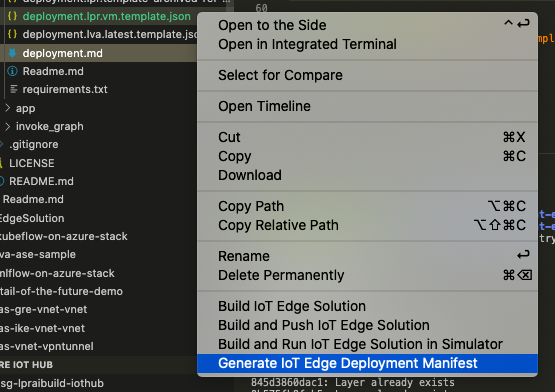

# On Building and Deploying LVA-ALPR
Repo for curbside pick-up demo using ALPR models in LVA platform.

## Specification

Using a video from 3 fixed cameras, the solution will:
- identify a vehicle by its license plate (LP) from a stream of live video
- use the identity to retrieve an "order" associated with the identity
- display the order along with supporting information about the vehicle (e.g., the LP, an image of the vehice)
- the solution should identify a vehicle within 3 seconds

We are making the following assumptions:
- daytime lighting conditions
- car pulls into a specific, monitored parking spot (one of two)
- the car LP exists in the system and is unique (i.e. state is not identified at this time)

### Design

The solution will ingest video using LVA. It will pass frames to a model running on the same edge device as LVA.
When a LP is detected, the detection event flows through the associated IoT Hub and is processed by Stream Analytics.

The event will contain:
- the licence plates
- timestamp
- bounding box

Stream Analytics will aggregate events and update a store when a vehicle is determined to present.
A web app will monitor the store. When a vehicle is present the web app will display an "order" association with the vehicle.

NOTE: We don't really need to store and retrieve orders. This can be faked in the web app.

Instead of Stream Analytics, we could substitue a simple controller app that maintains a dictionary of LPs that it has seen. Every time an event is recive we touch the entry. The entries could time-out when it has received a touch after a certain period (20 seconds?). We should research if Stream Analytics will be a faster approach.

## Prerequisites

> Using VS Code, both with [Docker](https://marketplace.visualstudio.com/items?itemName=ms-azuretools.vscode-docker) and [Azure IoT Tools](https://marketplace.visualstudio.com/items?itemName=vsciot-vscode.azure-iot-tools) extensions, will ease building and deploying, no matter the target device you use.

## First Steps

- Clone this repo.

- Within `src/alpr/lva_ai_solution/` create a `.env` file with the following properly replaced:

```
CONTAINER_REGISTRY_USERNAME_myacr="<replace-me>"
CONTAINER_REGISTRY_PASSWORD_myacr="<replace-me>"
SUBSCRIPTION_ID="<replace-me>"
RESOURCE_GROUP="<replace-me>"
AMS_ACCOUNT="<replace-me>"
AAD_TENANT_ID="<replace-me>"
AAD_SERVICE_PRINCIPAL_ID="<replace-me>"
AAD_SERVICE_PRINCIPAL_SECRET="<replace-me>"
INPUT_VIDEO_FOLDER_ON_DEVICE="<replace-me>"
OUTPUT_VIDEO_FOLDER_ON_DEVICE="<replace-me>"
APPDATA_FOLDER_ON_DEVICE="<replace-me>"
```

## Building LPR Container

- Build from `Dockerfile` with new tag from ML solution (`lva_ai_solution`) directory, e.g.,

    `docker build -t lpr:v.1.1 -f Dockerfile .` (may require `sudo` upfront depending on your setup)

- Tag and Push image to your registry, e.g. (using Azure Container Registry),

    `docker tag lpr:v.1.1 <youracrusername>.azurecr.io/lpr:v.1.1`
    `docker push <youracrusername>.azurecr.io/lpr:v1.1`

## Deploying to IoT Edge Device

Depending the operations schema, you may end up using an IoT Edge Device, that sits on a) a Server (we'll call it VM for short), or into an Azure Stack Edge device (ASE). There're subtle differences into each.

> Be it a VM or ASE, make sure you're reflecting your newly pushed `image:` under "lpraimodule".

### VM based IoT Edge Device
Template: `src/alpr/deployment.lpr.vm.template.json`

* Make sure folders mapped as Binds, exist on the host VM.
    * input
    * output
    * appdata

    i.e. create a top folder in `/var/iotedgedata` with `mkdir` command. In there add the 3 folders (assuming `cd /var/iotedgedata`):
    `mkdir input`
    `mkdir output`
    `mkdir appdata`

* Then, assign permissions to it and all the subdirectories created (i.e. `chmod -R ug+rw /var/iotedgedata`)

* To deploy the template into target IoT Edge Device, point your Azure IoT Hub to the one where the IoT Edge Device is configured (here's some [help](https://github.com/Microsoft/vscode-azure-iot-toolkit/wiki). Then, follow these steps.
    
    1. Right click on your template (from VS Code) and select "Generate IoT Edge Deployment Manifest"
    
    2. If all goes fine, you'll see a notification. Now click on your template (from VS Code) and select "Generate IoT Edge Deployment Manifest"
    


### ASE based IoT Edge Device
Template: `src/alpr/deployment.lpr.ase.template.json`

* Make sure your shares are in place for `output`, `input` and `appdata`
[TODO: more-details-here]

* To deploy the template into target IoT Edge Device, point your Azure IoT Hub to the one where the IoT Edge Device is configured (here's some [help](https://github.com/Microsoft/vscode-azure-iot-toolkit/wiki). Then, follow these steps.
    
    1. Right click on your template (from VS Code) and select "Generate IoT Edge Deployment Manifest"
    
    2. If all goes fine, you'll see a notification. Now click on your template (from VS Code) and select "Generate IoT Edge Deployment Manifest"
    