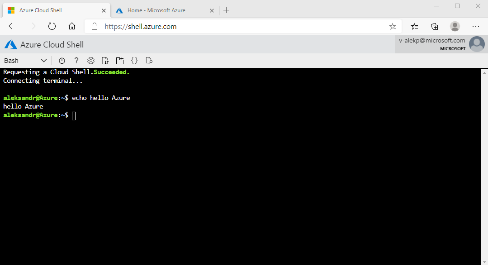
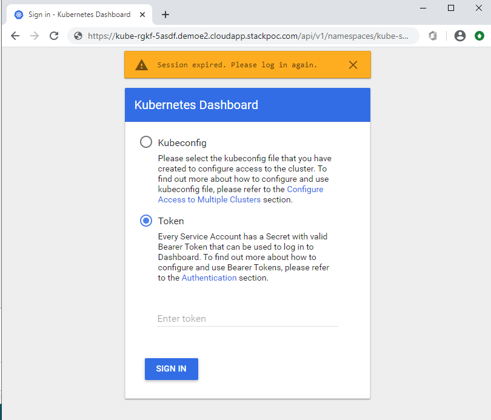

# Introduction and installation of Kubeflow on Azure Stack

The reader is expected to be familiar with the following:

- [Docker](http://docker.com), see our [Introduction to Docker](introduction_to_docker.md) as a refresher.
- [Azure](http://azure.com) CLI, and Microsoft Azure subscription covering AKS.
- [Azure Stack Hub](https://azure.microsoft.com/en-us/products/azure-stack/hub/)
- [Kubernetes](https://kubernetes.io/)
- [Kubeflow](https://github.com/kubeflow/kubeflow)
- [Bash](https://docs.microsoft.com/en-us/azure/cloud-shell/quickstart)
- [Jupyter](https://jupyter.org/).
- [TensorFlow](https://www.tensorflow.org/)
- [Tensorboard](https://www.tensorflow.org/tensorboard/)
- [PyTorch](https://pytorch.org/)

Pick the machine from which you will do this lab. It would be convenient location for keeping the scripts,
aliases, keys, setup certificates, keep track of your configuration files.

You can open a cloud shell from your Azure Portal:

It will look like so:

You can also go directly to `https://shell.azure.com` URL to open your Azure cloud shell:

Azure Stack does not have a cloud shell, so you could use:

- laptop with Windows 10,
- a "jump" server in your environment. If you do not, we will create one in next few modules.

You will need:

- git (to clone this repository, or your own fork of it)
- web browser
  - to access Azure portals
  - to work with dashboards
  - to lookup updated information
- terminal or a vm.

We will be using Microsoft Edge browser, and Ubuntu terminal. Follow these instructions to install Ubuntu on your Windows 10
machine : [https://ubuntu.com/tutorials/ubuntu-on-windows](https://ubuntu.com/tutorials/ubuntu-on-windows)
Pin the shortcut to your task bar for convenience. Try that Ubuntu termianal works, open the app, type a bash command:

Alternatives to it would be VirtualBox or WMVare clients. Or, you can always install Ubuntu directly on your laptop.

## Azure Stack Portal and Azure CLI

IMPORTANT: While you might have the premissions to retrieve some information on your
own(see [User Information on Azure](acquiring_settings.md)) or create, but most likely
you will need to ask your cloud administrator. You need the following:

  - The link to your Azure Stack Hub Portal (`https://portal.demo2.stackpoc.com/signin/index/@demo.ondemo.com` in this tutorial)

See additional prerequisites if you are [Installing Kubernetes](installing_kubernetes.md) yourself.

In spirit of infrastracture-as-code paradigm, most of things are better run using command line interface of configuration files.

Clone this repository to use the provided scripts and configuration files. You can do it, for example, using comannd line:

    $ git clone https://github.com/Azure-Samples/azure-intelligent-edge-patterns.git

Then go to the `sbin` directory in Kubeflow section (we will give the description of each of the files
later in this section):

    $ cd Research/kubeflow-on-azure-stack-lab/sbin
    $ ls
    check_status.sh
    clean_evicted.sh
    edit_external_access.sh
    get_kf_board_ip.sh
    get_kubernetes_info.sh
    get_token.sh
    inference.yaml
    kubeflow_install.sh
    kubeflow_uninstall.sh
    persistence.yaml
    start_tb.sh
    tensorboard.yaml

# Pre-requisites

## A Kubernetes cluster

If you do not have a Kubernetes cluster already, follow [Installing Kubernetes](installing_kubernetes.md).

**make sure you have the values from [Prerequisites](installing_kubernetes.md#prerequisites) section**.

If you did everything correctly, at this point you could ssh to the master node and check
the cluster. You can find master node's public IP address at the Portal(select
subscription `KFDemo2Subscription` and click on the master node):

It would be helpful to record the master ip, and create a one-line script containing
something like the following to connect from your "jump" server: 

    $ ssh -i ~/.ssh/id_rsa_demokey azureuser@12.345.123.45
    Authorized uses only. All activity may be monitored and reported.
    Welcome to Ubuntu 16.04.6 LTS (GNU/Linux 4.15.0-1061-azure x86_64)
    ...

You should see the bash shell to a server with `master` in its name.

## Check that you can see the nodes:

    azureuser@k8s-master-27515788-0:~$ kubectl cluster-info
    Kubernetes master is running at https://kube-rg3-123456.demoe2.cloudapp.example.com
    CoreDNS is running at https://...
    kubernetes-dashboard is running at https://...
    Metrics-server is running at https://...
    To further debug and diagnose cluster problems, use 'kubectl cluster-info dump'.

## Check that you can see the nodes:

    azureuser@k8s-master-27515788-0:~$ kubectl get nodes
    NAME                       STATUS   ROLES    AGE   VERSION
    k8s-linuxpool-27515788-0   Ready    agent    22m   v1.15.5
    k8s-linuxpool-27515788-1   Ready    agent    22m   v1.15.5
    k8s-linuxpool-27515788-2   Ready    agent    22m   v1.15.5
    k8s-master-27515788-0      Ready    master   22m   v1.15.5

## (Optional) Check that you can see Kubernetes Dashboard

You are welcome to check if you can see the Kubernetes board from your
machine. You can get your Kubernetes Dashboard's address from `cluster-info`:

    $ kubectl cluster-info
    ...
    kubernetes-dashboard is running at https://kube-rgkf-5.demoe2.cloudapp.stackpoc.com/api/v1/namespaces/kube-system/services/https:kubernetes-dashboard:/proxy
    ...

You might need to contact your cloud administrator to retrieve the certificates from your cluster, here
is the link with instructions how to do it: [Access the Kubernetes Dashboard in Azure Stack Hub](https://docs.microsoft.com/en-us/azure-stack/user/azure-stack-solution-template-kubernetes-dashboard?view=azs-2002#import-the-certificate).

We provided a script to retrieve a login token(which is a time-sensitive operation, talk to your
cloud administrator to use the imported `kubeconfig` instead):

    $ sbin/get_token.sh
    Name:         namespace-controller-token-masdg
    Type:  kubernetes.io/service-account-token
    token:      12345678904DETcwwkZAyHfzD1Wp8_58eVbzthMmsh1P4ca9mXCB12wEhwS_J0VCsN4ektqjYmoTiXOuc2TGz7XlFys2BBhZLINMH3WYexaHPXovGGtRRg_D8rd_WA-T03SKZwpuPGljb-dYi_NyxqTtwufz7duBRX_1f3Ga4_3f8zEx5wqUCHL4vD2xyaG_EMxhmOpqPBPvlhk3s_dj0_ZGdsLvJZE4cWI1LHGFEuwghc5vPhnJb9QZvsdfgRzbPwUZT4IOsS_tS65Wk

Cut/paste that token into the Sign In screen:

Again, you might need to contact your cloud administrator to retrieve the certificates from your cluster
to access these links, you should be able to see the Kubernetes Dashboard in a browser:

## (Optional) Check your DockerHub login

If you do not know what Docker is, review our [Introduction to Docker](introduction_to_docker.md) as a refresher.

---

# Installing Kubeflow

The simpliest way to istall Kubeflow is to use a CNAP package.

**Prerequisite:**
- Will need the k8 cluster ".kubeconfig" file on your local machine to execute commands on the k8 cluster 
- Below instructions are not intended to be run from the master node, but from another Linux dev environment
- Clone the github repo at "/home/user/" path

## Step 1: Install Porter

Make sure you have Porter installed. You can find the installation instructions for your OS at the link provided below.

[Installation Instructions for Porter](https://porter.sh/install/)

**NOTE:** be sure to add porter to your PATH so it can find the binaries

## Step 2 : Install CNAB Packages

We have CNAB packages for Kubeflow, use this link to install: [Kubeflow Installation On Kubernetes using CNAB](porter/kubeflow/Readme.md)

In case CNAB package installation does not work, you can do it maually, see [Installing Kubeflow manually](installing_kubeflow_manually.md).

---

# Preparing Kubeflow dashboard

Make sure all the pods are up and running(Using `kubectl get all -n kubeflow`, wait until
they are).

To access the dashboard using external connection, replace `"type: NodePort"` with
`"type: LoadBalancer"` using the editor (default editor is vi, to edit you need
to press `i`, and to save and exit, `<esc>:wq`):

    $ kubectl edit -n istio-system svc/istio-ingressgateway
    service/istio-ingressgateway edited

Then the EXTERNAL-IP will become available from:

    $ kubectl get -w -n istio-system svc/istio-ingressgateway
    NAME                   TYPE           CLUSTER-IP     EXTERNAL-IP   PORT(S)                          AGE
    istio-ingressgateway   LoadBalancer   10.0.123.210   12.34.56.78   15020:30397/TCP,80:31380/TCP,..  7m27s

## Example Kubeflow dashboard

When you have your istio-ingressgateway's external ip(you can retrieve it using `get_kf_board_ip.sh`),
open it in your browser, and make sure your firewall rules allow HTTP port 80.

You can monitor Kubeflow cluster by looking at the Kubernetes status, you might need to wait to
let the pods create containers and start.

For more information see [Installing Kubeflow on Azure](https://www.kubeflow.org/docs/azure/deploy/install-kubeflow/)

# Uninstalling Kubeflow

If you installed Kubeflow using `kubeflow_install.sh`, you can remove it using `kubeflow_uninstall.sh`:

    $ ./kubeflow_uninstall.sh
    Removing Kubeflow from /opt/sandboxASkf, according to kfctl_k8s_istio.v1.0.2.yaml

It runs `kfctl delete` on the same .yaml that was used to create the cluster. If you are not
using `kubeflow_unistall.sh` script, you would need to do it manually(`kfctl delete -f <the sript's name>`).

To see Kubeflow's pods disappear, run `check_status.sh` script:

    $ ./check_status.sh
    NAMESPACE         NAME                                            READY   STATUS        RESTARTS   AGE
    kubeflow          argo-ui-7ffb9b6577-n295r                        0/1     Terminating   0          31m
    kubeflow          jupyter-web-app-deployment-679d5f5dc4-2cvwt     0/1     Terminating   0          31m
    kubeflow          metadata-grpc-deployment-5c6db9749-jx2tl        0/1     Terminating   5          31m
    kubeflow          metadata-ui-7c85545947-55smm                    0/1     Terminating   0          31m
    Press Ctrl-C to stop...
    NAMESPACE         NAME                                            READY   STATUS        RESTARTS   AGE
    kubeflow          metadata-grpc-deployment-5c6db9749-jx2tl        0/1     Terminating   5          31m
    kubeflow          metadata-ui-7c85545947-55smm                    0/1     Terminating   0          31m
    Press Ctrl-C to stop...
    NAMESPACE         NAME                                            READY   STATUS      RESTARTS   AGE
    Press Ctrl-C to stop...
    NAMESPACE         NAME                                            READY   STATUS      RESTARTS   AGE
    ^C

One last thing is left - to remove the Kubeflow folder. The `kubeflow_uninistall.sh` script gives you
the exact command you need to run according to your configuration, if you left default settings,
it will look like so:

    $ sudo rm -rf /opt/sandboxASkf

You can now re-install it if you would like.

---

[Back to main page](../Readme.md) | [Next to 01-Jupyter](../01-Jupyter/Readme.md)
