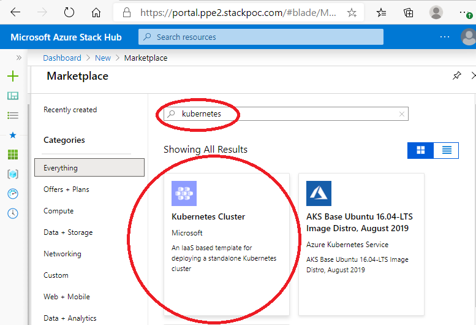
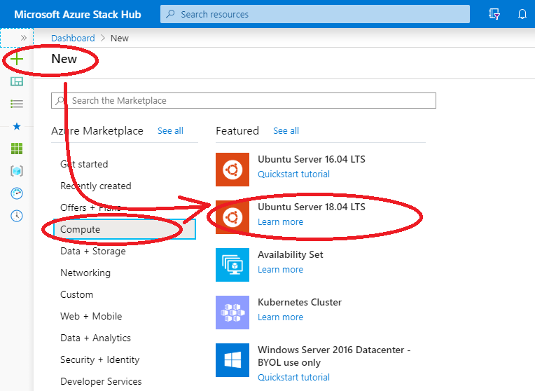
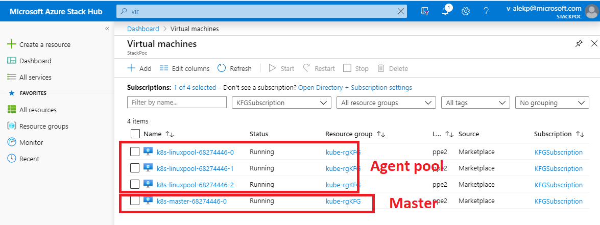
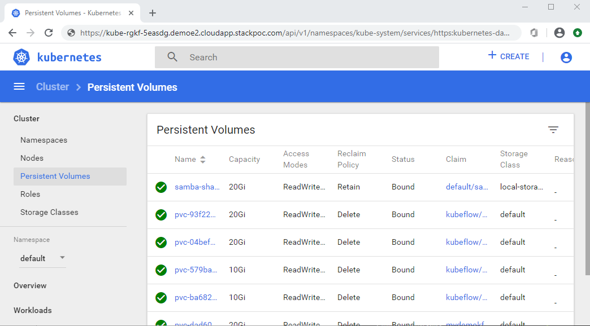

# Installing Kubernetes for Kubeflow cluster

Kubeflow is an orchestration ecosystem that functions within Kubernetes. Here are the steps
to create a Kubernetes cluster on Azure Stack Hub.

## Prerequisites

The reader is expected to be familiar with the following:

- [Azure](http://azure.com) CLI, and Microsoft Azure subscription covering AKS.
- [Azure Stack Hub](https://azure.microsoft.com/en-us/products/azure-stack/hub/)
- [Kubernetes](https://kubernetes.io/)
- [Kubeflow](https://github.com/kubeflow/kubeflow)
- [Jupyter](https://jupyter.org/).
- [Bash](https://docs.microsoft.com/en-us/azure/cloud-shell/quickstart)

IMPORTANT: While you might have the premissions to retrieve some information on your
own(see [User Information on Azure](acquiring_settings.md)) or create, but most likely
you will need to ask your cloud administrator. You need the following:

  - The link to your Azure Stack Hub Portal (`https://portal.demo2.stackpoc.com/signin/index/@demo.ondemo.com` in this tutorial)
  - your portal URL (`https://portal.demo2.stackpoc.com` in this tutorial)
  - your Azure Subscription (`KFDemo2Subscription`, with ID `123-SUBSCRIPTION-456` in this tutorial).
  See if you can [create a subscription](creating_a_subscription.md) yourself.
  - Service Principal ID (`azure-stack-spn-demo` in this tutorial).
  See if you can [create a service principal](creating_service_principal.md) yourself. If you can create it, you will create the following too
  (otherwise you might be able to [retrieve them](acquiring_settings.md)): 
    - Tenant ID (Directory ID for this spn) (`12345-TENANT-67890` in this tutorial)
    - Application (client) ID (`12345-APPLICATION-67890` in this tutorial)
    - the secret associated with that Service Principal ID(`XYZSUPERSECRET1234567890` in this tutorial, but it is better to not use the secret value directly)
  - cloud name (`DEMOE2` in this tutorial)
  - cloud location (`demoe2` in this tutorial)
  - Azure Environment (`AzureStackCloud` in this tutorial)
  - These are for cloud registration `"az register ..."`
    - endpoint resource manager(`https://management.demoe2.example.com` in this tutorial)
    - storage endpoint(`portal.demoe2.example.com` in this tutorial)
    - keyvault dns or some other security mechanisms your team is using(`.vault.portal.demoe2.example.com` in this tutorial)
  

Make sure you have all this information before proceeding further.

You can chose to create a Kubernetes object from your Portal, keeping
in mind the settings and adjustments we discuss below.

# Installing Kubernetes using AKS-e (Skip the rest of the page if you did it using Portal)

## Login to the desired cloud

We recommend you run the following commands(up to the creation of the Kubernetes cluster) from an Ubuntu vm inside of your Azure Stack.

If you do not already have a vm, create it using web Portal(ask your Azure Stack
administrator for the link("The link to your Azure Stack Hub Portal" in the Prerequisites checklist above). Be aware that www.azure.com will not work - it is for the public cloud).

Once the vm is created, you can ssh or rdp to it and open a terminal. Click button `Connect` in the details
of the vm in Portal to see which user name and public ip address you can use, or download the rdp configuration.
If your vm's public ip is `12.34.56.78` and you created your vm specifying userid `azureuser`, it would look like so on MacOS, Linux:

    $ ssh azureuser@12.34.56.78

Or, on Windows, in command prompt, PowerShell, or a terminal of your choice:

    c:\Work> ssh azureuser@12.34.56.78

You can also use [Ubuntu sub-system](https://docs.microsoft.com/en-us/windows/wsl/install-win10) that it part of Windows 10.

## Installing Azure CLI

Some images already have Azure CLI, in case your vm does not, see [Install Azure CLI with apt](https://docs.microsoft.com/en-us/cli/azure/install-azure-cli-apt?view=azure-cli-latest).

    $ curl -sL https://aka.ms/InstallAzureCLIDeb | sudo bash
    ...
    The following NEW packages will be installed:
    azure-cli
    0 upgraded, 1 newly installed, 0 to remove and 34 not upgraded.
    ...

## Registering with the correct cloud

Run `az cloud list` to see which cloud is currently active.

If it is not where you want to create your Kubernetes cluster, register with the correct cloud like so:

    $ az cloud register -n DEMOE2 --endpoint-resource-manager "https://management.demoe2.example.com" --suffix-storage-endpoint "portal.demoe2.example.com" --suffix-keyvault-dns ".vault.portal.demoe2.example.com"
    The cloud 'DEMOE2' is registered.

Set it as active:

    $ az cloud set -n DEMOE2

It may be helpful to update it to the desired API version(`2019-03-01-hybrid` in the command below):

    $ az cloud update --profile 2019-03-01-hybrid

Login to the desired cloud(with the data from Prerequisites checklist above):

    $ az login --tenant demo.ondemo.com --service-principal -u 12345-APPLICATION-67890 -p XYZSUPERSECRET1234567890
    [
      {
        "cloudName": "DEMOE2",
        "id": "12345-1234-1234-1234-12344321",
        "isDefault": true,
        "name": "KFDemo2Subscription",
        "state": "Enabled",
        "tenantId": "12345-TENANT-67890",
        "user": {
          "name": "12345-APPLICATION-67890",
          "type": "servicePrincipal"
        }
      }
    ]

You can run `az cloud list` to confirm your registration and login are correct. Look for
the active cloud in your .json or the format you chose.

## Create Kubeflow Kubernetes cluster

A cluster for Kubeflow will be created using 'aks-endine', although, you could create
a resource group using Portal, or CLI (it is an OPTIONAL step, you can skip it):

    $ az group create --name sandboxRG3kf --location demoe2
    {
        "id": "/subscriptions/123456789-1234-9876-123456789123456/resourceGroups/sandboxRG3kf",
        "location": "demoe2",
        "managedBy": null,
        "name": "sandboxRG3kf",
        "properties": {
            "provisioningState": "Succeeded"
        },
        "tags": null,
        "type": null
    }

If you do not have a suitable key pair already, you can generate one using `ssh-gen`,
you can name it, for example, `id_rsa_for_demo`:

    $ ssh-keygen -t rsa -b 4096

You will need the public portion of your key pair in the "ssh" in .json below. If you have any problems, see [Create SSH Key Pair](https://docs.microsoft.com/en-us/azure/virtual-machines/linux/mac-create-ssh-keys)
or 
[App Identity in Azure Stack Hub](https://docs.microsoft.com/en-us/azure-stack/operator/azure-stack-create-service-principals)

Create a folder for the .json with the Kubernetes definition:

    $ mkdir -p ~/DEMO_KF
    $ cd ~/DEMO_KF

Download the aks-engine template like so:

    $ curl -o kube-KFDEMO_demoe2.json https://raw.githubusercontent.com/Azure/aks-engine/master/examples/azure-stack/kubernetes-azurestack.json

Edit the deployment definition file. Plug in the settings from the Requirements
checklist above, and adjust for your own configuration and desired scale.

In our case we updated these fields:

- "portalURL": "https://portal.demo2.stackpoc.com"
- "dnsPrefix": "kube-rgDEMO2"
- "keyData": "\<whatever is in id_rsa_for_demo.pub\>"
- updated the `"orchestratorReleaseVersion"` from 1.15 to 1.15.5(which is among the listed supported versions)

Let's also change the master count from 3 to 1. Here is the resulting `kube-rgDEMO2_demoe2.json`:

    {
        "apiVersion": "vlabs",
        "location": "",
        "properties": {
            "orchestratorProfile": {
                "orchestratorType": "Kubernetes",
                "orchestratorRelease": "1.15",
                "kubernetesConfig": {
                    "cloudProviderBackoff": true,
                    "cloudProviderBackoffRetries": 1,
                    "cloudProviderBackoffDuration": 30,
                    "cloudProviderRateLimit": true,
                    "cloudProviderRateLimitQPS": 3,
                    "cloudProviderRateLimitBucket": 10,
                    "cloudProviderRateLimitQPSWrite": 3,
                    "cloudProviderRateLimitBucketWrite": 10,
                    "kubernetesImageBase": "mcr.microsoft.com/k8s/azurestack/core/",
                    "useInstanceMetadata": false,
                    "networkPlugin": "kubenet",
                    "kubeletConfig": {
                        "--node-status-update-frequency": "1m"
                    },
                    "controllerManagerConfig": {
                        "--node-monitor-grace-period": "5m",
                        "--pod-eviction-timeout": "5m",
                        "--route-reconciliation-period": "1m"
                    }
                }
            },
            "customCloudProfile": {
                "portalURL": "https://portal.demoe2.example.com",
                "identitySystem": ""
            },
            "featureFlags": {
                "enableTelemetry": true
            },
            "masterProfile": {
                "dnsPrefix": "kube-rgDEMO2",
                "distro": "aks-ubuntu-16.04",
                "count": 1,
                "vmSize": "Standard_D2_v2"
            },
            "agentPoolProfiles": [
                {
                    "name": "linuxpool",
                    "count": 3,
                    "vmSize": "Standard_F16",
                    "distro": "aks-ubuntu-16.04",
                    "availabilityProfile": "AvailabilitySet",
                    "AcceleratedNetworkingEnabled": false
                }
            ],
            "linuxProfile": {
                "adminUsername": "azureuser",
                "ssh": {
                    "publicKeys": [
                        {
                            "keyData": "ssh-rsa SOMESUPERSECRETKEYNOBODYKNOWSSOMESUPERSECRETKEYNOBODYKNOWSSOMESUPERSECRETKEYNOBODYKNOWSSOMESUPERSECRETKEYNOBODYKNOWSSOMESUPERSECRETKEYNOBODYKNOWSSOMESUPERSECRETKEYNOBODYKNOWSSOMESUPERSECRETKEYNOBODYKNOWS"
                        }
                    ]
                }
            },
            "servicePrincipalProfile": {
                "clientId": "",
                "secret": ""
            }
        }
    }

### Downloading aks-engine

If you already have a suitable `aks-engine`, you may skip this chapter, or if you have any problems,
see details in a separate page, [Installing aks-engine](installing_aks-engine.md). These are the steps:

Download `aks-engine` installation script:

    $ curl -o get-akse.sh https://raw.githubusercontent.com/Azure/aks-engine/master/scripts/get-akse.sh
    $ chmod 700 get-akse.sh

Run the installer, specifying its version:

    $ ./get-akse.sh --version v0.43.0

If you have problems, please refer to the official page: [Install the AKS engine on Linux in Azure Stack](https://docs.microsoft.com/en-us/azure-stack/user/azure-stack-kubernetes-aks-engine-deploy-linux).

In the completely disconnected environment, you need to acquire the archive via a machine that
does have the connection, and uncompress it on the machine where you plan using it:

    $ tar xvzf aks-engine-v0.xx.x-linux-amd64.tar.gz -C /usr/local/bin

Verify `aks-engine` version:

    $ aks-engine version
    Version: v0.43.0
    GitCommit: 8928a4094
    GitTreeState: clean

## Running deploying Kubernetes using aks-engine

If Azure Resource Manager endpoint is using a self-signed certificate, you need to explicitly add the root certificate to trusted certificate store of the machine:

    $ sudo cp /var/lib/waagent/Certificates.pem /usr/local/share/ca-certificates/azurestackca.crt 
    $ sudo update-ca-certificates

Run `aks-engine deploy` command filling in the information pieces you gathered in the check list
in [Prerequisites](#prerequisites). It is a lengthy process, taking several minutes, depending on your
chosen configuration(number of nodes, etc.):

    $ aks-engine deploy -m kube-rgDEMO2_demoe2.json --auth-method client_secret --auto-suffix \
        --azure-env AzureStackCloud --client-id 12345-APPLICATION-67890 --client-secret XYZSUPERSECRET1234567890 \
        --force-overwrite --location demoe2 --resource-group kube-rgDEMO \
        --subscription-id 123-SUBSCRIPTION-456 --debug
    INFO[0000] Writing cloud profile to: /tmp/azurestackcloud.json045678
    DEBU[0000] Resolving tenantID for subscriptionID: 123-SUBSCRIPTION-456
    DEBU[0000] Already registered for "Microsoft.Compute"
    DEBU[0000] Already registered for "Microsoft.Storage"
    DEBU[0000] Already registered for "Microsoft.Network"
    DEBU[0006] pki: PKI asset creation took 3.586868203s
    DEBU[0006] output: wrote _output/kube-rgKF-5e9a2ec4/apimodel.json
    DEBU[0006] output: wrote _output/kube-rgKF-5e9a2ec4/azuredeploy.json
    DEBU[0006] output: wrote _output/kube-rgKF-5e9a2ec4/azuredeploy.parameters.json
    DEBU[0006] output: wrote _output/kube-rgKF-5e9a2ec4/kubeconfig/kubeconfig.demoe2.json
    DEBU[0006] output: wrote _output/kube-rgKF-5e9a2ec4/ca.key
    DEBU[0006] output: wrote _output/kube-rgKF-5e9a2ec4/ca.crt
    DEBU[0006] output: wrote _output/kube-rgKF-5e9a2ec4/apiserver.key
    DEBU[0006] output: wrote _output/kube-rgKF-5e9a2ec4/apiserver.crt
    DEBU[0006] output: wrote _output/kube-rgKF-5e9a2ec4/client.key
    DEBU[0006] output: wrote _output/kube-rgKF-5e9a2ec4/client.crt
    DEBU[0006] output: wrote _output/kube-rgKF-5e9a2ec4/kubectlClient.key
    DEBU[0006] output: wrote _output/kube-rgKF-5e9a2ec4/kubectlClient.crt
    DEBU[0006] output: wrote _output/kube-rgKF-5e9a2ec4/etcdserver.key
    DEBU[0006] output: wrote _output/kube-rgKF-5e9a2ec4/etcdserver.crt
    DEBU[0006] output: wrote _output/kube-rgKF-5e9a2ec4/etcdclient.key
    DEBU[0006] output: wrote _output/kube-rgKF-5e9a2ec4/etcdclient.crt
    DEBU[0006] output: wrote _output/kube-rgKF-5e9a2ec4/etcdpeer0.key
    DEBU[0006] output: wrote _output/kube-rgKF-5e9a2ec4/etcdpeer0.crt
    INFO[0006] Starting ARM Deployment (kube-rgKF-987654321). This will take some time...
    INFO[0497] Finished ARM Deployment (kube-rgKF-987654321). Succeeded

If you did everything correctly, at this point you could ssh to the master node and check
the cluster. You can find master node's public IP address at the Portal(select
subscription `KFDemo2Subscription` and click on the master node):

It would be helpful to record the master ip, and a connecting script containing
something like the following: 

    $ ssh -i ~/.ssh/id_rsa_demokey azureuser@12.345.123.45
    Authorized uses only. All activity may be monitored and reported.
    Welcome to Ubuntu 16.04.6 LTS (GNU/Linux 4.15.0-1061-azure x86_64)
    ...

    azureuser@k8s-master-27515788-0:~$ kubectl cluster-info
    Kubernetes master is running at https://kube-rg3-123456.demoe2.cloudapp.example.com
    CoreDNS is running at https://...
    kubernetes-dashboard is running at https://...
    Metrics-server is running at https://...
    To further debug and diagnose cluster problems, use 'kubectl cluster-info dump'.

    azureuser@k8s-master-27515788-0:~$ kubectl get nodes
    NAME                       STATUS   ROLES    AGE   VERSION
    k8s-linuxpool-27515788-0   Ready    agent    22m   v1.15.5
    k8s-linuxpool-27515788-1   Ready    agent    22m   v1.15.5
    k8s-linuxpool-27515788-2   Ready    agent    22m   v1.15.5
    k8s-master-27515788-0      Ready    master   22m   v1.15.5

## Post-installation configuration

Make sure you have the right firewall rules and other settings before you start using your cluser.

## Persistence on Azure Stack

Most real-life applications need data storage. Azure Stack team actively works on making
available the options available on the public cloud, however, there are nuances in a detauched
environment.

For this demo we will substitute `azurefile` with our own locally-mounted network storage.

Follow the steps in [Installing Storage](../01-Jupyter/installing_storage.md) to create a Persistent Volume Claim
that you could use in your Kubernetes deployments.

For simplicity, we create a Samba server, but you are welcome to use nfs
version of your choice. You will only update the firewall rules for your
solution, Samba server requires inbound port range `"137-139,445"`

If you done everything right, you should be able to see this `pvc` in your environment:

    $ kubectl get pvc
    NAME                STATUS   VOLUME               CAPACITY   ACCESS MODES   STORAGECLASS    AGE
    ...
    samba-share-claim   Bound    samba-share-volume   20Gi       RWX            local-storage   23h
    ...

And you should see the Persisted Volume itself:

    $ kubeclt get pv
    NAME               CAPACITY ACCESS MODES   RECLAIM POLICY STATUS CLAIM                       STORAGECLASS    REASON   AGE
    ...
    samba-share-volume 20Gi     RWX            Retain         Bound  default/samba-share-claim   local-storage            23h
    ...

Consult your cloud system administrator if you have any problems, there could be many other
options sutable to particular scenarios and development lifecycle.

## (Optional) Check that you can see Kubernetes Dashboard

You are welcome to check if you can see the Kubernetes board from your
machine. You can get your Kubernetes Dashboard's address from `cluster-info`:

    $ kubectl cluster-info
    ...
    kubernetes-dashboard is running at https://kube-rgkf-5.demoe2.cloudapp.stackpoc.com/api/v1/namespaces/kube-system/services/https:kubernetes-dashboard:/proxy
    ...

You might need to contact your cloud administrator to retrieve the certificates from your cluster, here
is the link with instructions how to do it: [Access the Kubernetes Dashboard in Azure Stack Hub](https://docs.microsoft.com/en-us/azure-stack/user/azure-stack-solution-template-kubernetes-dashboard?view=azs-2002#import-the-certificate).

We provided a script to retrieve a login token(which is a time-sensitive operation, talk to your
cloud administrator to use the imported `kubeconfig` instead):

    $ sbin/get_token.sh
    Name:         namespace-controller-token-masdg
    Type:  kubernetes.io/service-account-token
    token:      12345678904DETcwwkZAyHfzD1Wp8_58eVbzthMmsh1P4ca9mXCB12wEhwS_J0VCsN4ektqjYmoTiXOuc2TGz7XlFys2BBhZLINMH3WYexaHPXovGGtRRg_D8rd_WA-T03SKZwpuPGljb-dYi_NyxqTtwufz7duBRX_1f3Ga4_3f8zEx5wqUCHL4vD2xyaG_EMxhmOpqPBPvlhk3s_dj0_ZGdsLvJZE4cWI1LHGFEuwghc5vPhnJb9QZvsdfgRzbPwUZT4IOsS_tS65Wk

Cut/paste that token into the Sign In screen:

Again, you might need to contact your cloud administrator to retrieve the certificates from your cluster
to access these links, you should be able to see the Kubernetes Dashboard in a browser:

## (Optional) Check your DockerHub login

If you do not know what Docker is, review our [Introduction to Docker](introduction_to_docker.md) as a refresher.

---

[Back](Readme.md)
