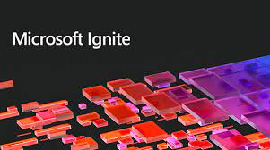
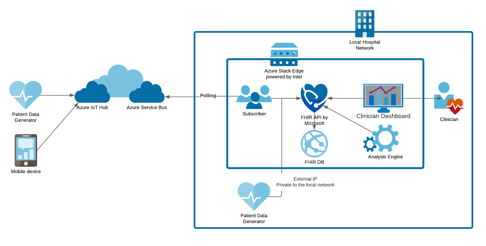

# Patient Data Analysis using Azure Stack Edge

**The Art of Possible** 

Remote patient monitoring is a telehealth solution that provides early recognition insights regarding a patient’s acute or chronic condition so clinical teams can have the right information, about the right patient, at the right time to drive early interventions to improve clinical outcome. Through the use of Azure Stack Edge powered by Intel this can be done in a secure, scalable, and cost reductive manner.

This proof of concept provides a working example of how to collect, store, and analyze patient data using Azure Stack Edge, powered by Intel. Our patient data generator creates mock patient vitals (heart rate, respiration rate, blood pressure, SpO2, weight) in three different scenarios that the user can choose – improving, worsening, stable. Sending this data, either through IoT Hub on the public cloud (remote patient scenario) or directly to FHIR API (in-clinic scenario), the data is stored in a FHIR server on the Azure Stack Edge. Our analysis engine then analyzes the data for any noteworthy events and writes a flag back to the FHIR server in those cases. All data, including alerts for noteworthy patients, is then viewed in our clinician dashboard where the right information can make it to the right people at the right time.

This is demo code, and not ready for production use. While the scenario of remotely monitoring patients with varying degrees of Congestive Heart Failure (CHF), as well as consideration for typical hospital network architecture were considered; things like security, and HIPPA/PII were not considered for this proof of concept.

Check out [this video](https://myignite.microsoft.com/sessions/7ba986a0-9d05-4d22-abaa-b5f9d1916744) to learn more about the real-world possibilities this solution begins to unlock.

**Unlock the Potential of Edge & AI in Healthcare**

## Prerequisites

The following documentation will show you how to deploy and use the solution on your own Azure Stack Edge.
In order to fully deploy this software you will need several pieces of software, hardware, and cloud services.

### Software Prerequisites

You will need the following software on your machine in order to run and deploy this solution:

NOTE: For Windows users, it may be necessary to run your shells as an Administrator (right-click the shell you want to open and select `Run as Administrator`) in order for commands to work.
- (Windows users only) [Git Bash/Git for Windows](https://git-scm.com/downloads)
- (Windows users only) [Chocolatey](https://chocolatey.org/install)

- [Node](https://nodejs.org/en/)
  - Version 12 or higher is recommended
- [kubectl](https://kubernetes.io/docs/tasks/tools/install-kubectl/)
- [docker](https://docs.docker.com/get-docker/)
- (Optional) [docker-compose](https://docs.docker.com/compose/install/)
  - Included with Docker Desktop for Mac and Windows, but a separate install is required for Linux users
- [helm](https://helm.sh/docs/intro/install/)
- [az](https://docs.microsoft.com/en-us/cli/azure/install-azure-cli)
- [Java JDK](https://www.oracle.com/java/technologies/javase-downloads.html) (Only needed for building Android React Native app) - JDK SE 8 is recommended
- [Android Studio](https://developer.android.com/studio) (Only needed for building Android React Native app)
### Hardware Prerequisites

You will need the following hardware to deploy the solution:

- [Azure Stack Edge](https://azure.microsoft.com/en-us/products/azure-stack/edge/)

Although you can run this software locally or anywhere else that Docker containers can run, this software was purpose built for the Azure Stack Edge.

### Cloud Pre-reqs

If you want to utilize this solution with the remote patient scenario, you will need the following cloud services.

- [Azure Cloud Services](https://azure.microsoft.com/en-us/services/cloud-services/)
- [IoT Hub](https://azure.microsoft.com/en-us/services/iot-hub/)
- [Service Bus](https://azure.microsoft.com/en-us/services/service-bus/)
- [Azure Container Registry](https://azure.microsoft.com/en-us/services/container-registry/)

## Architecture

## Set up

1. [Configure your Azure Stack Edge and Kubernetes Cluster](./AzureStackEdgeInstall.md)
1. [Deploy cloud services in Azure Public](./azure-cloud-services/README.md)
1. Follow setup instructions for the [subscriber](./patient-data-subscriber/README.md)
1. Deploy Containers with Helm
     `helm dependency update helm && helm upgrade --install --recreate-pods everything helm`
1. [Generate some fake patient data](./data-generator/README.md)
1. _(Optional)_ [Connect your Blood Pressure cuff to the phone app](./patient-bluetooth-connect-app/README.md)

## Build Containers from Source (Optional)

A Docker Compose file is included to make it easier to build from source and push to your private registry. A configuration for Azure Container Registry (ACR) is included by default.

0. (If using ACR) [Authenticate to Docker to ACR](./k8s-setup/README.md)
1. Set your registry address variable `$docker_registry`
   - If using ACR: `source ./azure-cloud-services/outputs` (this file was generated in step 2)
   - If using some other registry: `export docker_registry='<your registry name>/'` (The full URL please, make sure to add a trailing slash and wrap the registry name in single quotes)
2. Build your images: `docker-compose build`
3. (You must be authenticated to your registry) Push your images: `docker-compose push`

## Direct Connection Scenario

As an alternate scenario, you might want to avoid cloud and connect a remote patient directly to software running on the Azure Stack Edge. Although this scenario is not implemented in this solution, it is feasible. [Click here for more details.](./DirectConnectScenario.md)

## Glossary of Terms

- Azure Stack Edge (ASE): Hardware that this software is intended for. [Read more](https://azure.microsoft.com/en-us/products/azure-stack/edge/)
- FHIR: Fast Healthcare Interoperability Resources [Read more](https://www.hl7.org/fhir/overview.html)
- Observation: This is a FHIR specific term. These are the individual vital readings or data sent to the FHIR server by the data-generator.
- Flag: This is a FHIR specific term.

## Common Issues

- `waiting to start: image can't be pulled`
  - This happens when your secret is malformed or named incorrectly.

## FAQs

**Q**: How do I want to make changes to the Kubernetes deployments without messing with Helm templates?

**A**: Easy! Just run 

    `helm template helm --dry-run > manifest.json` 
    
  This will generate the k8s manifests that you can edit as you see fit and deploy with `kubctl deploy manifest.json` _[**TODO:** Test this to be sure it works this way]_

# TODOs/Reminders

_**[Remove this section before release]**_

- call out that common things like resource quotas and security contexts are not included here
- `--set` is not working to override `acr_name`. Not sure why, but not be important if public docker registry is the happy path.
- "3. Deploy Containers with Helm" be be more robust and maybe its own page?
- for pre-reqs do we need additional validation that the software is installed and running correctly? (example, docker may be installed but not running `cant detect docker daemon`)
- There is nothing here about the omron device. should there me?  