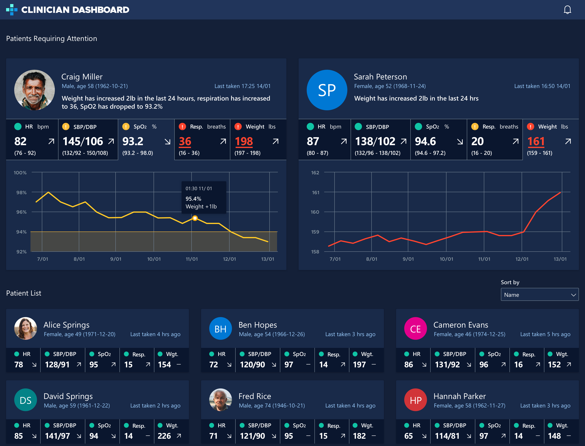

# Clinician Dashboard Web App
A React web application for viewing and organizing patient data stored in an FHIR Server on an Azure Stack Edge.

This is the dashboard for clinicians used to see patient data and alerts. It pulls data from the FHIR API.

## Deploy via Helm

The **recommended** approach is to deploy all containers at once with the Helm chart in the parent directory. (see [README](./../README.md#get-started))

But, if you want to deploy this single container you can do so by setting the empty values in [`values.helm`](./helm/values.yaml) and then running

``` bash
helm upgrade --install dashboard helm
```

# Development

## Prerequisite Software for Development

- [Node](https://nodejs.org/en/download/). _Recommended: 12 or higher_
- [az](https://docs.microsoft.com/en-us/cli/azure/install-azure-cli)
- [kubectl](https://kubernetes.io/docs/tasks/tools/)
- [Docker](https://www.docker.com/products/docker-desktop)

## Build the Docker Image

```
docker build -t dashboard .
```

## Run the Docker Image

```
docker run dashboard \
  --env FHIR_URL=<FHIR URL>
```

`FHIR_URL` here will be an address to your local or development FHIR server.
  
## Setting up k8s Access
Follow the steps documented in the "Get Started" section of the [README](./../README.md#get-started)

## Generate HELM Templates
Run the following command: ```helm template clinician-dashboard helm --dry-run```

# TODOs


_**[Remove this section before release]**_

- Many, many warnings about deprecated packages in npm install output. should we fix any of those?
- ports are defined twice in values.yaml. this could be dried up.
- remove fhir postman files (or clean them up and keep them? rick made it sound like those would be nice)